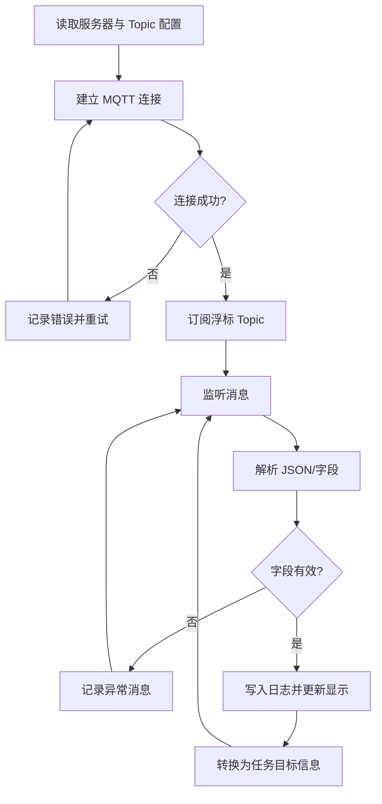

# 基于云端 MQTT 的自主帆船与异构浮标信息交互系统设计及实验验证

作者：待补充

单位：待补充

## 摘要

自主帆船在海洋环境监测、长期巡航和水面目标观测等任务中具有能耗低、续航时间长和环境适应性强等特点。随着海上无人系统从单平台自主航行逐步走向多平台协同与跨域信息共享，自主帆船不仅需要依赖自身导航传感器获取状态信息，也需要接入外部浮标、岸基站和云端平台发布的环境或航标信息。针对自主帆船与第三方浮标之间存在的系统异构、网络边界不一致和信息接口不统一等问题，本文设计了一种基于云端 MQTT 的自主帆船与异构浮标信息交互架构。该架构以云服务器中的 MQTT Broker 作为跨域信息中转节点，由克罗地亚方浮标发布浮标信息，我方上位机通过订阅相应 Topic 获取数据，并完成消息解析、日志记录、状态显示和后续任务接口封装。

在实验验证方面，本文首先介绍了在塞浦路斯开展的跨方浮标信息交互实验。由于第三方浮标的数据发布频率和外场测试窗口受实际实验安排限制，本次外场实验获得的信息包数量有限，因此本文将其定位为真实第三方浮标接入条件下的链路可达性和数据兼容性验证，而非大样本通信性能评估。实验结果表明，我方上位机能够通过云端 MQTT 链路成功订阅克罗地亚方浮标主题，并对接收到的有效数据包进行解析和记录。进一步地，本文设计了国内模拟信标绕标补充实验方案，在可控条件下由模拟信标按照兼容的 MQTT 消息格式发布目标信息，自主帆船通过上位机接收并解析信标数据，完成接近、绕标和驶离等任务流程。该补充实验用于验证所提信息交互架构在自主航行任务中的闭环应用能力。本文工作可为自主帆船接入外部海上信息节点、开展跨机构海上无人系统协同实验提供一种工程实现参考。

关键词：自主帆船；异构浮标；MQTT；云服务器；信息交互；绕标航行

## 1 引言

自主帆船是一类以风能为主要推进来源、依靠舵角和帆角调节实现自主航行的无人水面平台。与传统电推进无人艇相比，自主帆船在长航时、低能耗和低噪声任务中具有明显优势，适用于海洋环境监测、近岸巡逻、漂浮目标观测和长期数据采集等应用场景。然而，自主帆船的任务能力不仅取决于船体控制和路径规划算法，也与其获取外部环境和任务目标信息的能力密切相关。在复杂海上任务中，航标、浮标、岸基站以及其他无人平台可能分别掌握不同类型的状态信息。如何将这些外部信息接入自主帆船任务系统，是提升其任务适应性和协同能力的重要问题。

现有海上无人系统研究多围绕单平台自主航行、航迹跟踪、路径规划、远程监控和多艇协同控制展开。随着云计算和物联网通信技术的发展，云端服务器逐渐被用于无人艇远程任务规划、状态监控和数据存储。典型研究通过云服务器连接远程客户端和现场无人艇客户端，实现无人艇状态上传、任务下发以及多艇协同控制。此类研究表明，云端架构能够降低远程操作者与现场平台之间的网络耦合程度，并为跨地域实验提供统一的数据交互通道。Wang 等提出的云端无人艇任务控制架构即采用云服务器、远程用户客户端、本地接口插件和受控无人艇等模块，实现了面向无人艇编队的远程任务控制，并通过仿真、池试和克罗地亚海试进行了验证[1]。

但对于自主帆船与第三方浮标之间的信息交互而言，仅有云端远程控制架构仍不足以直接满足需求。一方面，外部浮标通常由其他机构部署和维护，其通信协议、数据发布频率和数据字段不完全受自主帆船系统控制；另一方面，自主帆船上位机不仅需要接收外部数据，还需要将其转换为可供任务规划或航行控制使用的信息。特别是在跨机构联合实验中，不同设备往往处于不同网络域，设备之间无法简单建立点对点连接。因此，需要一种轻量、松耦合、便于跨域访问的信息交互机制，使外部浮标能够以统一主题发布信息，自主帆船系统则通过订阅方式按需接入。

MQTT 是一种基于发布/订阅模式的轻量级消息传输协议，适用于低带宽、不稳定网络和多终端物联网场景[2-3]。在 MQTT 架构中，数据发布方和订阅方不直接建立业务耦合，而是通过 Broker 完成消息转发。该机制适合用于浮标、岸基站、无人船和云端平台之间的信息交换。对于本文所关注的自主帆船应用而言，MQTT Topic 可以用于区分浮标编号、消息类型和实验任务，上位机只需订阅约定主题即可获取外部浮标数据，从而避免与第三方设备建立复杂的专用通信接口。

基于上述背景，本文面向自主帆船与克罗地亚方浮标的信息交互需求，设计并实现一种基于云端 MQTT 的异构浮标信息接入架构。本文的主要工作包括：

（1）提出一种自主帆船与异构浮标之间的云端 MQTT 信息交互架构，将第三方浮标、云服务器、我方上位机和自主帆船控制系统纳入统一数据链路；

（2）设计上位机侧的 MQTT 订阅、消息解析、时间戳记录、状态显示和任务接口封装流程，为外部浮标信息进入自主帆船任务系统提供软件支撑；

（3）在塞浦路斯外场实验中验证我方上位机对克罗地亚方浮标 MQTT Topic 的订阅与解析能力，并在数据包数量有限的真实条件下证明跨方链路的可达性；

（4）规划并开展国内模拟信标绕标补充实验，通过可控信标信息发布和自主帆船绕标航行，进一步验证所提架构对任务闭环的支撑能力。

## 2 相关研究

### 2.1 海上无人系统云端控制架构

云端控制架构是近年来海上无人系统研究中的重要方向。传统无人艇任务系统通常将状态感知、任务规划、运动控制和数据记录功能集中部署在现场平台或岸基站中。当实验范围扩大到跨地域远程监控、多平台协同或多用户访问时，单一现场控制系统的可扩展性和访问灵活性会受到限制。云服务器能够为无人系统提供统一的数据中转、状态存储和任务分发能力，从而使远程操作者、现场平台和数据分析端通过同一服务进行交互。

Wang 等针对无人水面艇编队提出了云端任务控制架构。该架构以云服务器为核心，通过远程客户端连接操作者，通过本地客户端连接现场无人艇，并在无人艇端设计与 ROS 系统连接的本地接口。其系统组件包括云服务器、远程用户客户端软件、本地接口插件和受控无人艇，并通过仿真、池试和海试验证了系统的可行性[1]。该研究为本文提供了重要参考：一是将云服务器作为跨地域任务系统的中心节点；二是将远程人机交互端、现场平台端和云端服务解耦；三是通过分层实验逐步验证系统功能。

与上述工作不同，本文并不以多艇任务控制为主要目标，也不强调云端对无人艇的远程控制指令分发，而是聚焦于自主帆船对第三方浮标信息的接入。本文借鉴云端架构的分层思想，将云服务器作为自主帆船与外部浮标之间的信息中转节点，并进一步采用 MQTT 发布/订阅机制处理异构设备之间的数据交换问题。

### 2.2 自主船与外部浮标的信息交互

浮标是海洋观测和航道标识中的常见信息节点，可携带定位、姿态、环境传感器和通信设备，用于发布水文气象、设备状态或任务目标信息。对于自主船而言，外部浮标信息可用于辅助导航、目标识别、任务区域限定和协同观测。例如，在绕标、巡检或海上竞赛类任务中，自主船需要获取浮标位置或信标状态，并根据该信息生成局部航行目标。如果浮标信息只能通过人工输入或离线配置获得，则任务系统对外部环境变化的响应能力有限。

异构浮标接入的难点在于，浮标和自主船往往由不同团队开发，硬件平台、网络接入方式和数据格式均可能不同。在跨机构实验中，浮标侧通常只开放有限接口，且数据发布频率和测试窗口受到对方系统安排影响。因此，自主船系统需要具备较强的接口适应性：既要能够在真实外场条件下接入第三方浮标信息，也要能够在本地实验中通过模拟信标复现实验流程，以验证后续任务控制逻辑。

本文将塞浦路斯外场实验和国内模拟信标实验结合起来。前者用于验证自主帆船上位机能否在真实跨方环境中接收克罗地亚方浮标数据，后者用于在可控条件下验证同一信息交互机制能否支撑自主帆船完成绕标任务。两类实验的定位不同，但共同服务于自主帆船接入外部信标信息这一核心目标。

### 2.3 MQTT 发布/订阅通信机制

MQTT 采用发布者、订阅者和 Broker 组成的通信模型。发布者将消息发送到特定 Topic，订阅者根据 Topic 获取所需消息，Broker 负责消息路由和会话管理。与请求/响应式接口相比，发布/订阅机制降低了数据生产者和消费者之间的直接依赖，更适合多节点、弱耦合和事件驱动的系统。MQTT 3.1.1 已成为 OASIS 标准，MQTT 5.0 在会话属性、原因码和扩展能力等方面进一步增强[2-3]。

在海上无人系统中，MQTT 的优势主要体现在三个方面。第一，消息结构轻量，适合通过蜂窝网络、无线网桥或卫星链路传输低频状态信息。第二，Topic 层级清晰，便于按照设备、任务和数据类型组织消息。第三，发布方和订阅方不需要相互感知，有利于第三方浮标、云平台和自主帆船系统之间建立松耦合接口。本文基于上述特性，将 MQTT Broker 部署在云服务器中，使克罗地亚方浮标和我方上位机通过主题约定完成信息交互。

综上，已有研究已经验证了云端架构在无人艇远程控制中的价值，也表明 MQTT 适用于轻量级物联网消息传输。然而，针对自主帆船与第三方浮标之间的跨机构 MQTT 信息互操作，以及外部信标信息驱动的自主绕标任务闭环，仍缺少面向工程实验的系统化描述。本文工作正是围绕这一问题展开。

## 3 系统总体架构

### 3.1 设计目标

本文系统的设计目标是实现自主帆船对异构浮标信息的跨域接入，并为后续自主航行任务提供可用的目标信息。具体包括：

（1）跨方接入能力：我方上位机能够通过云服务器订阅克罗地亚方浮标发布的 MQTT Topic；

（2）数据解析能力：上位机能够对接收到的浮标消息进行字段解析、时间戳记录和格式化存储；

（3）任务接口能力：解析后的浮标信息能够转换为自主帆船绕标或目标接近任务所需的数据输入；

（4）可复现实验能力：在国内实验环境中，能够使用模拟信标复现外部浮标的信息发布过程，并验证任务闭环。

### 3.2 系统组成

系统总体架构如图 1 所示。系统由克罗地亚方浮标、云服务器/MQTT Broker、我方上位机、自主帆船控制系统和国内模拟信标五个部分组成。


图 1 系统总体网络架构图

克罗地亚方浮标作为真实外部信息源，在塞浦路斯实验中向云端 MQTT Broker 发布浮标状态或位置信息。云服务器作为跨域数据中转节点，负责维护 MQTT 连接、接收发布消息并向订阅端转发。由于浮标和自主帆船系统分别由不同机构维护，云服务器能够避免双方设备直接暴露在同一局域网或建立复杂点对点连接。

我方上位机是自主帆船系统接入外部浮标信息的核心软件节点。上位机通过 MQTT 客户端连接云服务器，并订阅约定的浮标 Topic。当接收到消息后，上位机执行数据解析、字段检查、时间戳记录、状态显示和日志保存。对于后续自主航行任务，上位机进一步将浮标经纬度、编号和状态等信息转换为控制系统可识别的目标信息。

自主帆船控制系统根据上位机提供的目标信息执行航行任务。本文关注的任务为绕标航行，即自主帆船在接收信标位置后，按照预设策略完成接近信标、围绕信标航行和驶离信标等过程。国内模拟信标用于在可控条件下复现实验链路，发布与克罗地亚方浮标兼容或近似兼容的 MQTT 消息，从而验证信息接入链路对任务闭环的支撑能力。

表 1 给出了系统各组成部分及其主要功能。

表 1 系统组成与功能

| 组成部分 | 部署位置 | 主要功能 |
| --- | --- | --- |
| 克罗地亚方浮标 | 塞浦路斯外场实验环境 | 发布真实浮标信息，作为第三方外部数据源 |
| 云服务器/MQTT Broker | 公网云服务器 | 维护 MQTT 连接，完成 Topic 消息转发 |
| 我方上位机 | 岸基站或自主帆船任务端 | 订阅 Topic、解析消息、显示状态、记录日志、提供任务接口 |
| 自主帆船控制系统 | 自主帆船平台 | 根据解析后的信标信息执行目标接近和绕标航行 |
| 国内模拟信标 | 国内补充实验环境 | 按兼容格式发布模拟信标信息，验证任务闭环 |

### 3.3 信息流与任务流

系统的信息流可分为真实浮标接入和模拟信标验证两种模式。在真实浮标接入模式下，克罗地亚方浮标将数据发布到云端 Broker，我方上位机订阅对应 Topic 后接收并解析消息。该模式的目标是验证跨机构、跨网络边界的信息接入能力。由于第三方浮标的发布频率和实验窗口不由我方完全控制，该模式不以大量重复通信样本为主要评价对象，而以链路可达性、消息可解析性和日志可追溯性作为主要验证内容。

在模拟信标验证模式下，国内模拟信标按照约定 Topic 和消息字段主动发布数据。上位机接收并解析模拟信标信息后，将其转换为自主帆船控制系统的目标输入。自主帆船据此完成绕标任务。该模式的目标是验证信息交互架构是否能够支撑完整任务闭环，并可用于补充获得航迹、任务完成率、绕标时间和目标距离等可量化结果。

## 4 MQTT 浮标信息订阅与处理方法

### 4.1 Topic 设计

MQTT Topic 是浮标信息组织和订阅的基础。为便于区分数据来源和消息类型，本文采用层级化 Topic 设计。实际 Topic 名称应以双方实验约定为准；在初稿中可采用如下形式进行描述：

```text
experiment/cyprus/buoy/{buoy_id}/state
experiment/cyprus/buoy/{buoy_id}/position
experiment/domestic/beacon/{beacon_id}/state
```

其中，`experiment` 表示实验系统根节点，`cyprus` 和 `domestic` 分别表示塞浦路斯外场实验和国内补充实验，`buoy` 或 `beacon` 表示数据来源类型，`{buoy_id}` 或 `{beacon_id}` 表示浮标或信标编号，`state` 和 `position` 表示消息类型。在实际系统中，也可将位置、状态和健康信息合并在同一 Topic 中发布，由消息字段进一步区分。

表 2 给出了本文建议使用的消息字段。若后续整理真实日志时发现字段名称不同，应在不改变论文逻辑的前提下替换为真实字段。

表 2 MQTT 消息字段说明

| 字段名 | 类型 | 含义 | 备注 |
| --- | --- | --- | --- |
| `timestamp` | string/int | 浮标侧或服务器侧时间戳 | 用于数据排序和延迟估计 |
| `buoy_id` | string | 浮标或信标编号 | 用于区分多个信息源 |
| `latitude` | float | 纬度 | WGS-84 坐标系，实际坐标系待确认 |
| `longitude` | float | 经度 | WGS-84 坐标系，实际坐标系待确认 |
| `status` | string/int | 浮标状态 | 可表示在线、离线、有效、异常等 |
| `source` | string | 数据来源 | 可选字段，用于区分真实浮标和模拟信标 |

### 4.2 上位机订阅流程

上位机侧 MQTT 订阅流程如图 2 所示。首先，上位机读取云服务器地址、端口、客户端 ID、用户名、密码和目标 Topic 等配置参数。随后，上位机创建 MQTT 客户端并向云端 Broker 发起连接请求。连接建立后，上位机订阅克罗地亚方浮标 Topic，并进入消息监听状态。当 Broker 转发新消息时，上位机回调函数对消息进行解析。如果消息字段完整且格式正确，则写入日志并更新显示界面；如果字段缺失或格式异常，则记录异常信息，避免将无效数据传递给控制系统。



图 2 MQTT 浮标信息订阅与处理流程图

上位机的消息处理包括以下步骤：

（1）消息接收：从 MQTT 回调函数中读取 Topic、Payload 和本地接收时间；

（2）格式解析：将 Payload 解析为 JSON 或约定结构体，提取时间戳、编号、经纬度和状态字段；

（3）有效性检查：检查关键字段是否存在，经纬度范围是否合理，时间戳是否可解析；

（4）日志记录：保存原始 Payload、解析结果、本地接收时间和处理状态；

（5）状态显示：在上位机界面中显示最近接收到的浮标编号、位置和更新时间；

（6）任务接口封装：将有效浮标位置转换为自主帆船控制系统可使用的目标点或绕标中心点。

### 4.3 数据记录与异常处理

由于跨机构实验中的第三方浮标发布频率、消息字段和网络连接条件均可能发生变化，上位机需要具备可追溯的数据记录能力。本文建议日志至少包含以下内容：本地接收时间、Topic、原始 Payload、解析后的浮标编号、经纬度、状态字段和解析结果。对于格式异常、字段缺失或连接中断等情况，上位机应记录对应错误类型，以便实验后分析。

在本文实验中，塞浦路斯外场获得的信息包数量较少。为避免样本不足导致结论过度扩展，本文仅基于日志证明系统完成了真实浮标 Topic 的订阅、数据接收和字段解析，不对大样本时延、丢包率或长期稳定性作强结论。后续若补充更长时间外场测试，可进一步统计端到端时延、消息间隔、连接恢复时间和有效消息比例等指标。

## 5 塞浦路斯跨方浮标信息交互实验

### 5.1 实验目的

塞浦路斯实验的目的是在真实跨方外场条件下，验证我方自主帆船上位机能否通过云端 MQTT 架构接入克罗地亚方浮标信息。与可控实验不同，第三方浮标的发布频率、实验时间窗口和可开放字段受到现场安排影响。因此，本节实验定位为真实第三方浮标接入的可行性验证，重点关注以下问题：

（1）我方上位机是否能够连接云服务器并订阅克罗地亚方浮标 Topic；

（2）上位机是否能够接收到有效 MQTT 消息；

（3）接收到的 Payload 是否能够按照约定字段解析；

（4）解析后的信息是否能够被记录并显示，为后续任务系统调用提供基础。

### 5.2 实验配置

实验系统由克罗地亚方浮标、云服务器、我方上位机和实验记录模块组成。克罗地亚方浮标负责发布真实浮标数据，云服务器负责 MQTT 消息转发，我方上位机订阅指定 Topic 并记录接收结果。实验过程中，上位机记录本地接收时间、Topic、原始消息内容和解析状态。

本节需要在后续版本中补充以下具体信息：

（1）云服务器所在地区、Broker 软件类型和端口配置；

（2）克罗地亚方浮标发布的真实 Topic 名称；

（3）上位机硬件环境、操作系统和 MQTT 客户端软件版本；

（4）实验日期、地点、持续时间和现场网络条件；

（5）真实接收日志中的字段名称和示例消息。

### 5.3 实验结果

实验期间，我方上位机成功连接云端 MQTT Broker，并完成对克罗地亚方浮标 Topic 的订阅。在第三方浮标发布有效消息时，上位机能够接收到对应数据包，并解析其中的编号、位置或状态等字段。由于克罗地亚方浮标的数据发布频率和外场测试窗口受实验安排限制，本次实验中获得的信息包数量有限。基于这一实际情况，本文不将该实验作为大样本通信性能评估，而将其作为真实跨方链路接入和消息兼容性验证。

表 3 给出了接收日志摘要的建议格式。后续应使用真实日志替换表中的占位内容。

表 3 塞浦路斯浮标信息接收日志摘要

| 序号 | 本地接收时间 | Topic | 浮标 ID | 纬度 | 经度 | 状态 | 解析结果 |
| --- | --- | --- | --- | --- | --- | --- | --- |
| 1 | 待补充 | 待补充 | 待补充 | 待补充 | 待补充 | 待补充 | 成功 |
| 2 | 待补充 | 待补充 | 待补充 | 待补充 | 待补充 | 待补充 | 成功 |
| 3 | 待补充 | 待补充 | 待补充 | 待补充 | 待补充 | 待补充 | 成功 |

从实验结果可以看出，所提架构能够在真实第三方浮标环境下完成基本信息接入。虽然数据量不足以支撑对长期稳定性或网络性能的充分评价，但已验证以下事实：克罗地亚方浮标、云端 Broker 和我方上位机之间能够建立有效信息链路；我方上位机能够识别并解析外部浮标消息；接收到的信息能够被记录，为进一步用于自主帆船任务系统提供数据基础。

### 5.4 讨论

塞浦路斯实验的价值主要体现在真实性。与本地模拟数据不同，第三方浮标由外部团队维护，其消息发布时间、发布频率和接口开放程度不受我方完全控制。因此，即使获得的信息包数量有限，该实验仍能够证明系统在跨机构、跨网络边界和异构设备条件下具有实际接入能力。

同时，本次实验也暴露出后续改进方向。首先，应在双方实验前进一步明确 Topic 命名、字段含义、发布时间和数据有效期，降低现场调试成本。其次，上位机应增强异常记录能力，对连接中断、字段缺失和时间戳异常进行分类存储。最后，若后续能够延长外场测试时间，可补充通信性能统计，包括消息间隔分布、有效消息比例、端到端时延和断连恢复时间等。

## 6 国内模拟信标绕标补充实验

### 6.1 实验目的

由于塞浦路斯外场实验中第三方浮标数据包数量有限，本文进一步设计国内模拟信标绕标补充实验。该实验的目的不是替代真实外场验证，而是在可控条件下复现 MQTT 信标信息发布过程，并验证自主帆船能否利用接收到的信标信息完成绕标任务。通过该实验，可以从任务层面证明所提信息交互架构不仅能够接收数据，还能够支撑自主航行闭环。

### 6.2 实验方案

国内实验系统由模拟信标、云端 MQTT Broker、我方上位机和自主帆船组成。模拟信标按照与塞浦路斯实验兼容的 Topic 和消息字段发布信标位置或状态信息。上位机订阅模拟信标 Topic，接收并解析消息后，将信标位置转换为绕标任务目标。自主帆船控制系统根据该目标生成航行指令，完成接近信标、绕行信标和驶离信标的任务过程。

实验流程如图 3 所示。


图 3 国内模拟信标绕标实验流程图

绕标任务可划分为三个阶段：

（1）接近阶段：自主帆船根据接收到的信标经纬度生成目标点，并从初始位置向信标附近航行；

（2）绕行阶段：当帆船进入设定半径范围后，以信标位置为中心生成绕标路径或关键航路点，完成绕行；

（3）驶离阶段：绕标完成后，帆船按照预设方向或下一目标点驶离信标区域。

若控制系统暂时不具备直接使用经纬度目标的接口，可由上位机先将经纬度转换为局部坐标系下的目标点，再传递给控制系统。该转换方式应在后续实验记录中补充说明。

### 6.3 评价指标

国内补充实验建议采用任务完成情况和航迹结果作为主要评价依据。可记录的指标包括：

（1）任务完成率：自主帆船是否完成接近、绕行和驶离三个阶段；

（2）绕标时间：从接收到有效信标信息到绕标任务完成的时间；

（3）最近绕标距离：航迹到信标中心的最小距离，用于判断是否进入有效绕标区域；

（4）平均绕行半径误差：实际航迹与期望绕标半径之间的偏差；

（5）有效消息比例：模拟信标发布消息中被上位机成功解析的比例；

（6）任务中断情况：记录是否出现 MQTT 连接中断、字段异常或控制系统拒绝目标点等问题。

表 4 给出了实验结果记录格式。

表 4 国内模拟信标绕标实验结果

| 实验编号 | 有效消息比例 | 绕标时间/s | 最近绕标距离/m | 平均半径误差/m | 任务完成情况 | 备注 |
| --- | --- | --- | --- | --- | --- | --- |
| 1 | 待补充 | 待补充 | 待补充 | 待补充 | 待补充 | 待补充 |
| 2 | 待补充 | 待补充 | 待补充 | 待补充 | 待补充 | 待补充 |
| 3 | 待补充 | 待补充 | 待补充 | 待补充 | 待补充 | 待补充 |

图 4 应给出典型实验航迹。建议在图中标注自主帆船起点、信标位置、期望绕标半径、实际航迹和任务结束点。若有多次实验，可选择一组代表性结果展示，并在表格中汇总多组结果。

图 4 自主帆船模拟信标绕标航迹图（待补充）

### 6.4 预期结果与分析方式

国内实验完成后，结果分析应围绕信息交互链路对任务闭环的支撑作用展开，而不是单独讨论航行控制算法优劣。若自主帆船能够在接收到模拟信标信息后完成绕标流程，则说明云端 MQTT 架构可以将外部信标信息转换为自主任务输入。若实验中出现绕标误差较大或任务中断，应结合风场、水流、定位误差、信标更新频率和控制策略分析原因。

在论文表述中，国内实验与塞浦路斯实验之间应形成互补关系：塞浦路斯实验验证真实第三方浮标接入的可行性，国内实验验证可控条件下的信息交互任务闭环。二者共同证明本文架构具有工程应用价值。

## 7 结论与展望

本文面向自主帆船与第三方浮标之间的信息交互需求，设计了一种基于云端 MQTT 的异构浮标信息接入架构。该架构以云服务器中的 MQTT Broker 为中转节点，将克罗地亚方浮标、我方上位机和自主帆船控制系统连接起来，实现外部浮标信息的发布、订阅、解析、记录和任务接口封装。与传统点对点通信方式相比，该架构降低了异构设备之间的直接耦合，更适合跨机构、跨地域海上无人系统联合实验。

在塞浦路斯外场实验中，我方上位机通过云端 MQTT 链路成功订阅克罗地亚方浮标 Topic，并对接收到的有效数据包进行解析和记录。受第三方浮标发布频率和外场测试窗口限制，本次实验获得的信息包数量有限，因此本文将其作为真实第三方浮标接入的链路可达性与数据兼容性验证。为进一步验证任务闭环能力，本文设计国内模拟信标绕标补充实验，通过模拟信标发布兼容 MQTT 消息，自主帆船接收并利用信标信息完成绕标航行，从而在可控条件下验证所提架构对自主任务执行的支撑作用。

后续工作将从三个方面展开。首先，补充更长时间的外场测试，统计消息间隔、有效消息比例、端到端时延和断连恢复时间等通信指标。其次，完善上位机异常处理和数据回放功能，使真实浮标日志能够用于离线仿真和算法复现。最后，将该架构扩展到多浮标、多自主船和多任务场景，进一步验证其在海上异构无人系统协同中的适用性。

## 参考文献

[1] Wang Z, Yang S, Xiang X, Vasilijević A, Mišković N, Nađ D. Cloud-based mission control of USV fleet: Architecture, implementation and experiments. Control Engineering Practice, 2021, 106: 104657. DOI: 10.1016/j.conengprac.2020.104657.

[2] OASIS. MQTT Version 3.1.1. OASIS Standard, 2014.

[3] OASIS. MQTT Version 5.0. OASIS Standard, 2019.

## 初稿后续补充清单

1. 补充作者、单位、基金项目和通讯作者信息。
2. 用真实 Topic 名称替换文中示例 Topic。
3. 用塞浦路斯原始日志填充表 3，并保留一条原始 Payload 示例。
4. 补充上位机界面截图或日志截图，作为真实接收证据。
5. 完成国内模拟信标绕标实验后，补充航迹图、表 4 和结果分析。
6. 根据目标期刊格式调整参考文献样式、图题表题和摘要字数。
